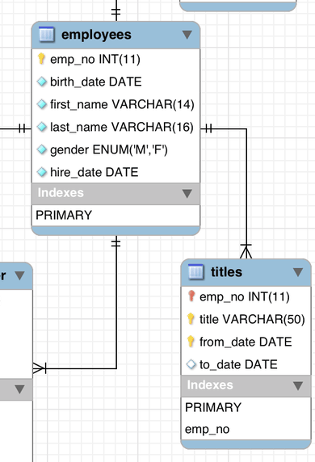
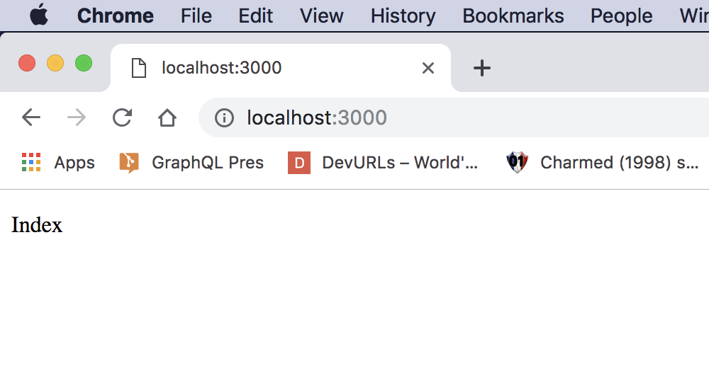
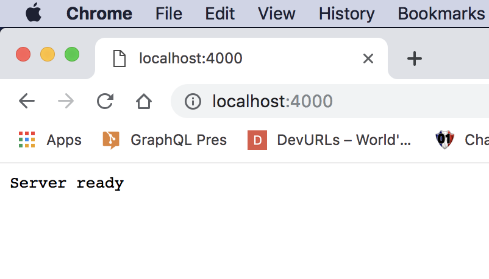
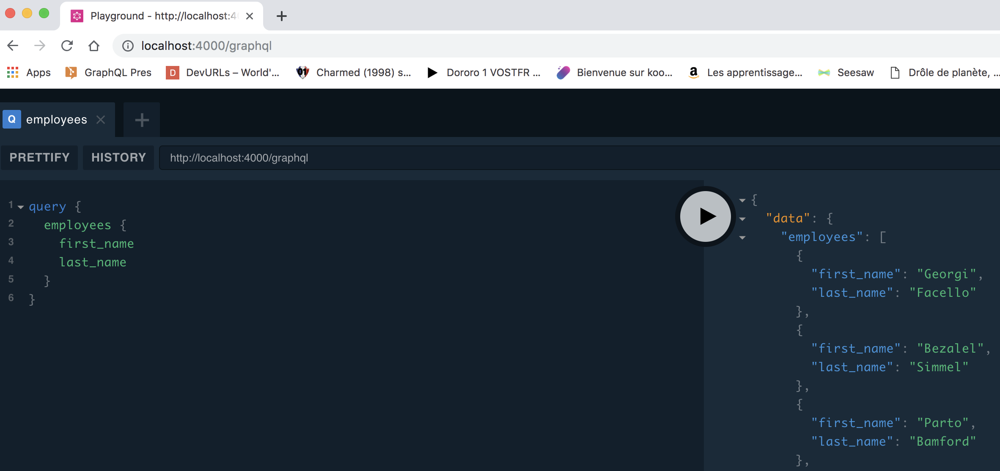
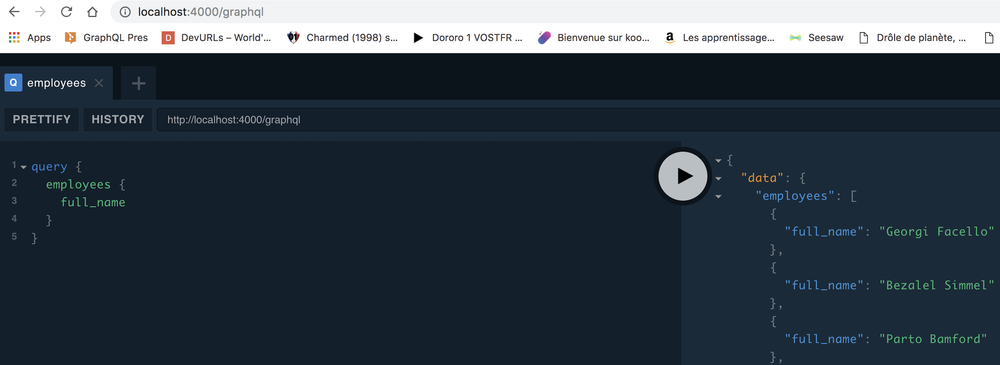
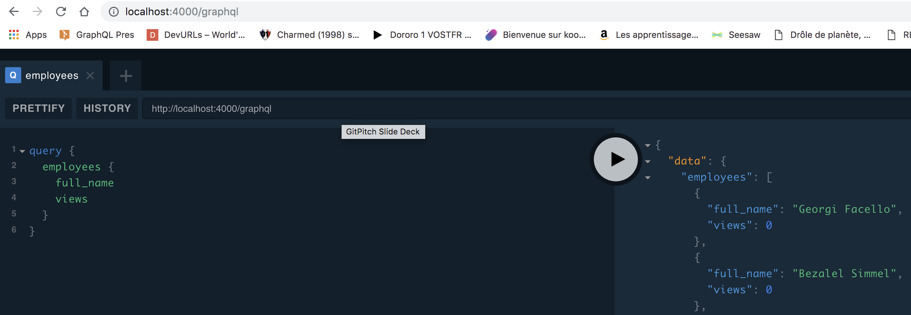
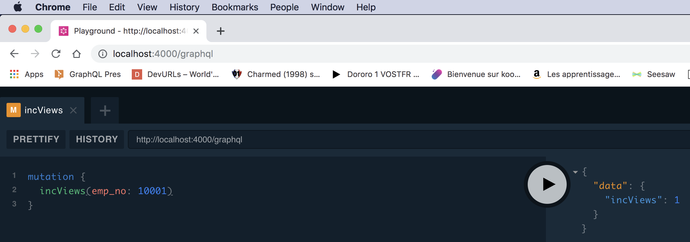
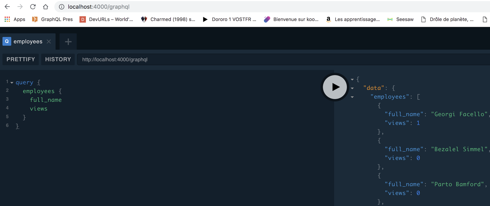
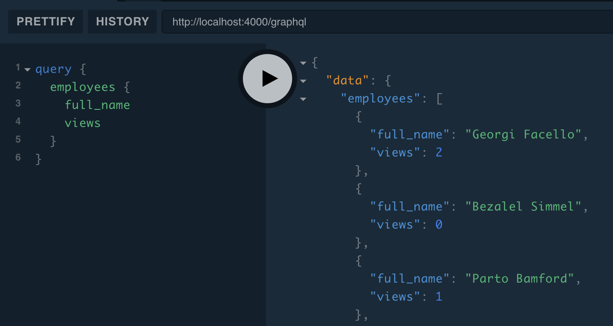

## GraphQL

@size[0.5em](... and an integration example with React)

---

## What is GraphQL?

GraphQL is an open-source data query and manipulation language for APIs, created by Facebook in 2015.

---

GraphQL is a **language specification**, not a lib/framework. There are some implementations, in different languages.

---

## GraphQL vs REST

@color[#e71e60](We should not compare them, because the usage is different, even if there are some usage intersections.)

* @size[0.8em](REST is an architectural style for creating Web services)
* @size[0.8em](GraphQL is mostly used as a BFF to unify multiple datasources for multiple targeted devices.)

---

## Three operations only

* @color[#e71e60](Query) -> Read
* @color[#e71e60](Mutation) -> Create, Update and Delete
* _@color[#e71e60](Subscription) -> Notify client_

---

## Types

* @color[#e71e60](Operations) are **root types** (Query, Mutation and Subscription)
* @color[#e71e60](Scalars): Int, Float, String, Boolean and ID
* @color[#e71e60](Enumerations)
* @color[#e71e60](Lists)
* **@color[#e71e60](Our own types)**

---?code=assets/types.gql

---

## Server: tow things only to do

1. Defining the @color[#e71e60](schema)
2. Defining the @color[#e71e60](resolvers): Layer between the schema and data.

---?code=assets/schema1.gql&title=Schema example

---?code=assets/queries.gql&title=Query example

---?code=assets/queries.json&title=Query response

---?code=assets/mutations.gql&title=Mutation example

---?code=assets/mutations.json&title=Mutation response

---?code=assets/interfaces.gql&title=Interfaces

---

## Let's code!

Create a **GraphQL server** which serves data from a **MySQL database** and a **in-memory map**.

Then create a **React app** which shows a dropdown and a button to trigger a mutation.

---?code=assets/pullandrunsql.sh&title=Get some SQL data

---

---?code=assets/project1.txt&title=Init the project

---?code=assets/project2.txt&title=Install next.js and React

---?code=assets/package1.json

---?code=assets/index1.js&title=The index page

---?code=assets/project3.txt&title=Let's run it

---

---?code=assets/schema2.gql&title=Schema (1)

---?code=assets/project4.txt&title=Install Express and Apollo

---?code=assets/server1.js&title=Basic server

---?code=assets/project5.txt

---?code=assets/package2.json

---

---?code=assets/project6.txt

---?code=assets/mysqlConnection.js&title=Mysql Connection

---?code=assets/resolvers1.js

---?code=assets/server2.js

---

---?code=assets/schema3.gql

---?code=assets/resolvers2.js

---

---?code=assets/schema4.gql

---?code=assets/resolvers3.js

---

---

---

---?code=assets/resolvers4.js

---

