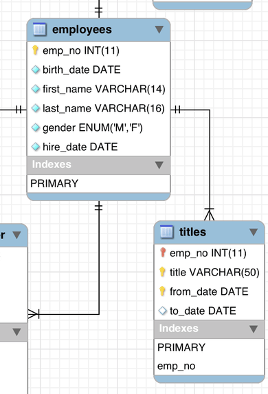
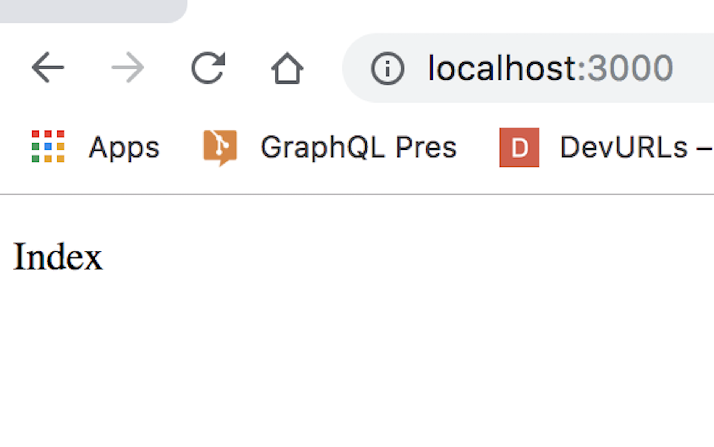
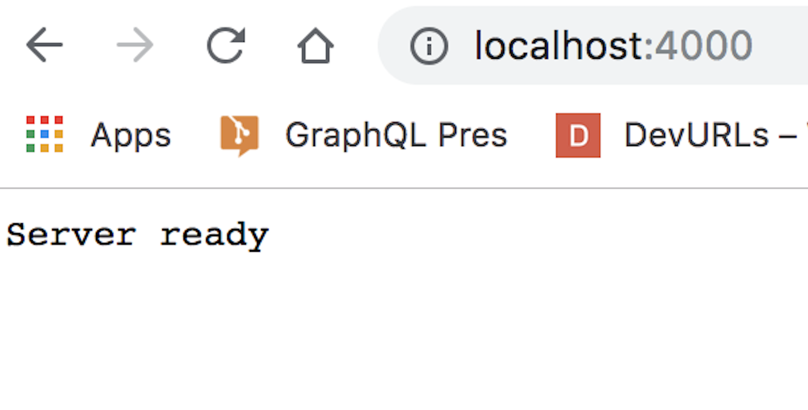
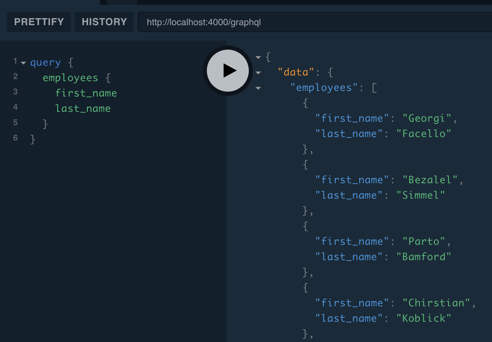
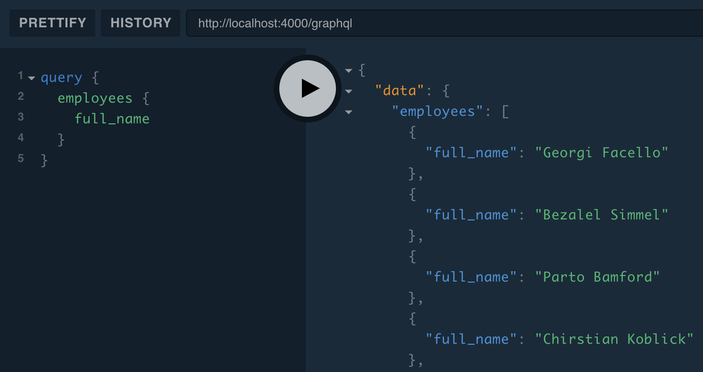
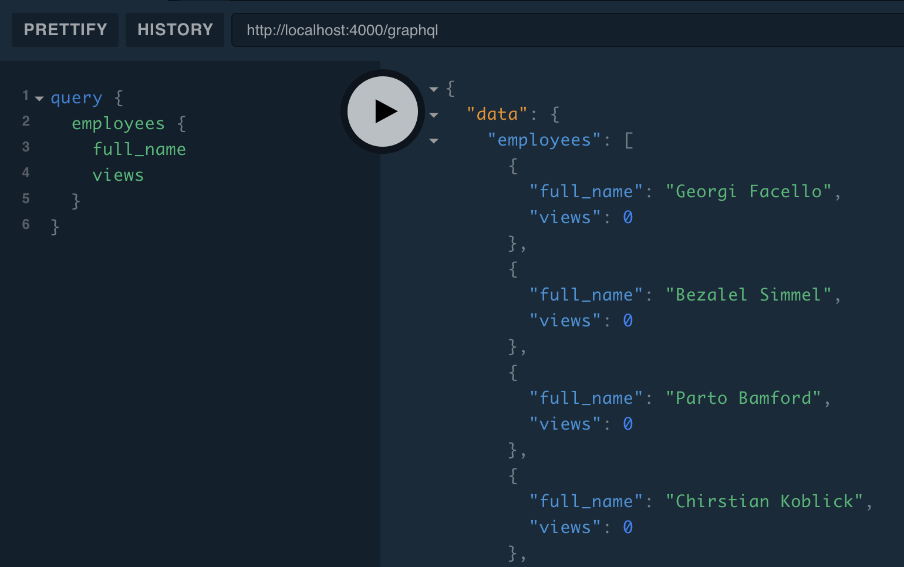
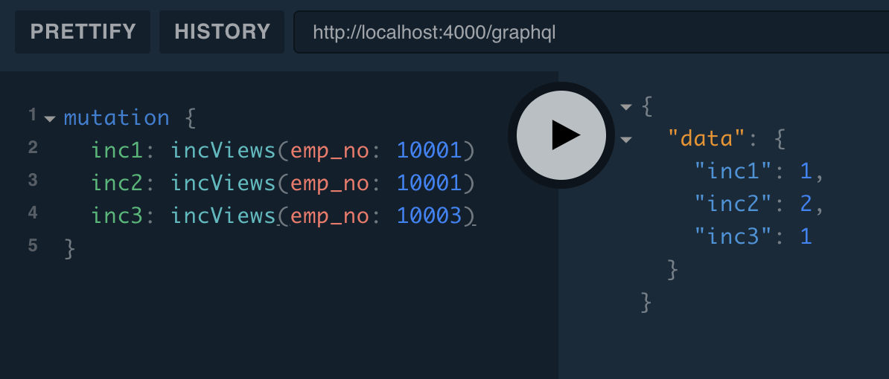
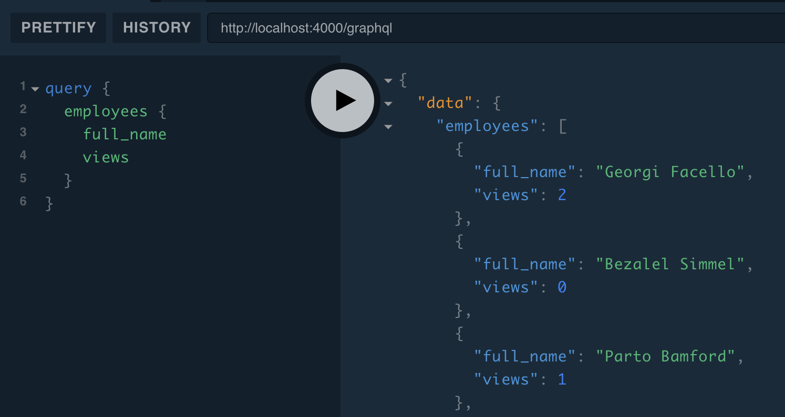
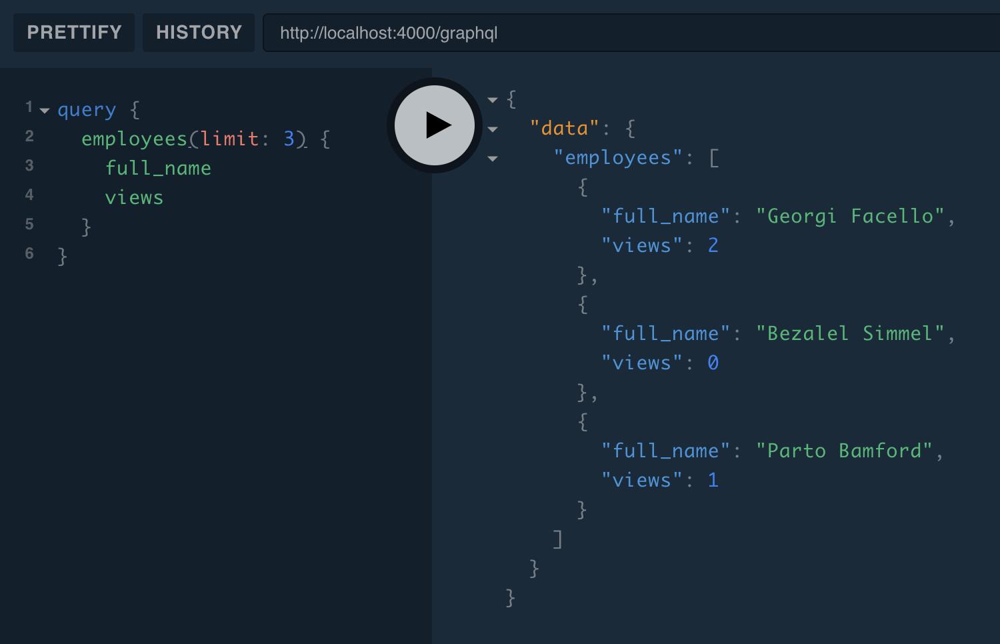

## GraphQL

@size[0.5em](... and an integration example with React)

---

## What is GraphQL?

GraphQL is an open-source data query and manipulation language for APIs, created by Facebook in 2015.

---

GraphQL is a **language specification**, not a lib/framework. There are some implementations, in different languages.

---

## GraphQL vs REST

@color[#e71e60](We should not compare them, because the usage is different, even if there are some usage intersections.)

* @size[0.8em](REST is an architectural style for creating Web services)
* @size[0.8em](GraphQL is mostly used as a BFF to unify multiple datasources for multiple targeted devices.)

---

## Three operations only

* @color[#e71e60](Query) -> Read
* @color[#e71e60](Mutation) -> Create, Update and Delete
* _@color[#e71e60](Subscription) -> Notify client_

---

## Types

* @color[#e71e60](Operations) are **root types** (Query, Mutation and Subscription)
* @color[#e71e60](Scalars): Int, Float, String, Boolean and ID
* @color[#e71e60](Enumerations)
* @color[#e71e60](Lists)
* **@color[#e71e60](Our own types)**

---?code=assets/gql/types.gql

---

## Server: only three things

1. Define the @color[#e71e60](schema) ()
2. (Optional) Define the @color[#e71e60](connectors)
3. Defining the @color[#e71e60](resolvers): Layer between schema/connectors

---?code=assets/gql/schema1.gql&title=Schema example

---?code=assets/gql/queries.gql&title=Query example

---?code=assets/json/queries.json&title=Query response

---?code=assets/gql/mutations.gql&title=Mutation example

---?code=assets/json/mutations.json&title=Mutation response

---?code=assets/gql/interfaces.gql&title=Interfaces

---

## Resolver function

    fieldName(obj, args, context, info) { result }

* obj: The object that contains the result returned from the resolver on the parent field, or, in the case of a top-level Query field, the rootValue passed from the server configuration. This argument enables the nested nature of GraphQL queries.
* args: An object with the arguments passed into the field in the query. For example, if the field was called with author(name: "Ada"), the args object would be: { "name": "Ada" }.
* context: This is an object shared by all resolvers in a particular query, and is used to contain per-request state, including authentication information, dataloader instances, and anything else that should be taken into account when resolving the query. If you’re using Apollo Server, read about how to set the context in the setup documentation.
* info: This argument should only be used in advanced cases, but it contains information about the execution state of the query, including the field name, path to the field from the root, and more. It’s only documented in the GraphQL.js source code.

---

## Data sources

Data loader, Connector etc...

@size[0.5em](_Classes that encapsulate fetching data from a particular service, with built-in support for caching, deduplication, and error handling. You write the code that is specific to interacting with your backend._)

---?code=assets/js/datasource.js&title=REST DS

---

## Deep into an example

Create a **GraphQL server** which serves data from a **MySQL database** and a **in-memory map**.

Then create a **React app** which shows a dropdown and a button to trigger a mutation.

---?code=assets/pullandrunsql.sh&title=Get some SQL data

---

## Schema (part of...)

---?code=assets/textes/project1.txt&title=Init the project

---?code=assets/textes/project2.txt&title=Install next.js and React

---?code=assets/json/package1.json

---?code=assets/js/index1.js&title=The index page

---?code=assets/textes/project3.txt&title=Let's run it

---

---?code=assets/gql/schema2.gql&title=Schema (1)

---?code=assets/textes/project4.txt&title=Install Express and Apollo

---?code=assets/js/server1.js&title=Basic server

---

---?code=assets/textes/project5.txt

---?code=assets/json/package2.json

---?code=assets/textes/project6.txt

---?code=assets/js/mysqlConnection.js&title=Mysql Connection

---?code=assets/js/resolvers1.js&title=Resolve employees

---?code=assets/js/resolvers12.js&title=Resolve Employee's title

---?code=assets/js/server2.js&title=Integrate Apollo with Express

---

---?code=assets/gql/schema3.gql&title=full_name definition

---?code=assets/js/resolvers2.js&title=full_name resolver

---

---?code=assets/gql/schema4.gql&title=views definition

---?code=assets/js/resolvers3.js&title=views resolver

---

---

---

---?code=assets/js/resolvers4.js&title=Pagination

---

---?code=assets/js/client.js&title=Apollo client

---?code=assets/js/index2.js

---

## Code time

---

## HOC / Provider

---?code=assets/js/withApollo.js&title=Apollo HOC

---?code=assets/js/my_app.js&title=Next.js App Override

---?code=assets/js/EmployeesDropdown_alt.js&title=Apollo HOC Query
